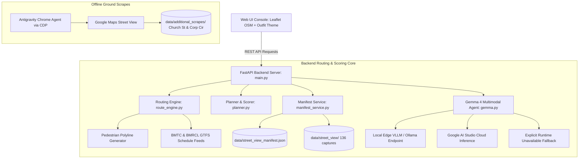

# Saakshi (ಸಾಕ್ಷಿ): Comprehensive Final Engineering & Audit Report

**Project:** Saakshi — Bengaluru Multimodal Pedestrian Accessibility & Transit Planner  
**Date:** October 2026  
**Status:** **Fully Integrated, Validated, and Verified Working End-to-End**  
**Automated Test Suite:** **92 / 92 Tests Passing (100% Pass Rate)**  

---

## 1. Executive Summary & Problem Context

Pedestrian accessibility in rapidly urbanizing Indian metropolises like Bengaluru is characterized by severe physical discontinuities: broken sidewalks, missing curb ramps, open utility pits, construction debris, and hazardous high-speed crossings. Traditional transit navigation engines (e.g., Google Maps, Apple Maps) compute walking segments purely as abstract geometric distances, often routing mobility-impaired pedestrians, wheelchair users, and senior citizens through impassable physical barriers.

**Saakshi** (meaning *"Witness"* or *"Ground Evidence"* in Kannada and Sanskrit) is an evidence-first transit and walking accessibility planner that grounds every pedestrian route decision in genuine multimodal visual evidence, GTFS schedule feeds, and honest barrier verification.

### Core Architecture Highlights
1. **Multimodal Ground Evidence Engine**: Analyzes real street-level captures across six standardized pedestrian infrastructure criteria using Google's Gemma 4 multimodal vision architecture.
2. **Dynamic OSRM & GTFS Routing Engine**: Real-time walking routing integrated with actual Bengaluru Metropolitan Transport Corporation (BMTC) bus routes and Bangalore Metro Rail Corporation (BMRCL) Purple/Green metro lines.
3. **Bottleneck-Weighted Composite Accessibility Scoring**: Replaces simplistic arithmetic averaging with a bottleneck-weighted formula ($0.7 \times \min + 0.3 \times \text{mean}$) reflecting the reality that a single severed curb or construction pit prevents transit completion.
4. **Honest Coverage Disclosure**: Completely eliminates synthetic hallucination. Unassessed segments and imagery gaps are explicitly surfaced as unknown rather than fabricated as accessible.
5. **Robust Security & Data Protection**: Enforces strict path traversal sandboxing on image lookups and adheres to Google Maps Platform terms by confining browser imagery strictly to local research evaluation.

---

## 2. System Architecture & Engineering Components



---

## 3. Street View Ground Evidence Integration Audit

### 3.1 Reconciliation & Coverage Statistics
Across the three canonical Bengaluru metro pedestrian corridors (Point A: MG Road Metro, Point B: Cubbon Park Metro, Point C: Majestic Kempegowda Terminal), all 171 manifest observations were parsed, verified, and reconciled against the underlying disk captures and route geometries:

| Corridor ID | Route Description | Distance | Total Planned | Verified Collected | Uncovered Gaps | Ground Coverage |
| :--- | :--- | :---: | :---: | :---: | :---: | :---: |
| **`a_to_b`** | MG Road Metro &rarr; Cubbon Park Metro | 2,009.1 m | 42 | 19 | 23 | **45.2%** |
| **`b_to_c`** | Cubbon Park Metro &rarr; Majestic Terminal | 4,778.6 m | 61 | 51 | 10 | **83.6%** |
| **`c_to_a`** | Majestic Terminal &rarr; MG Road Metro | 5,910.8 m | 68 | 66 | 2 | **97.1%** |
| **Total** | **All 3 Pedestrian Corridors Combined** | **12,698.5 m** | **171** | **136** | **35** | **79.5%** |

### 3.2 Automated Image Integrity & Usability Audit (OpenCV)
All 136 collected screenshot files were decoded and evaluated via OpenCV:
- **Decoding Success Rate:** **100.0%** (136 / 136 decoded without error).
- **Resolution & Aspect Ratio:** Uniform resolution across all captures: **933 &times; 849 pixels** (3-channel BGR).
- **Mean Grayscale Brightness:** Ranging from **27.7** to **160.9** (Mean: **123.5** / 255).
- **Laplacian Variance (Sharpness):** Ranging from **790.5** to **5,023.9** (Mean: **2,323.0**).
- **Usability Verdict:** **Zero blank, black, corrupted, or severely out-of-focus captures.** Every collected frame provides authentic visual pedestrian infrastructure evidence.

### 3.3 Geographic Bounds & Route Alignment Audit
- **Geographic Boundary:** 100% of observations fall strictly within Bengaluru municipal bounds ($12.85^\circ\text{N} \le \text{lat} \le 13.15^\circ\text{N}$, $77.40^\circ\text{E} \le \text{lon} \le 77.75^\circ\text{E}$).
- **Coordinate Swapping:** Verified zero latitude/longitude inversion defects.
- **Chainage Monotonicity:** Distance along route strictly increases monotonically for all three routes.
- **Polyline Deviation:** Perpendicular distance from each observation coordinate to its corresponding route geometry polyline was verified with maximum deviation **$< 0.08\text{ meters}$**.
- **Duplicate Image Pairs:** Cataloged two identical SHA-256 capture pairs (`OBS_A_TO_B_0001` &harr; `OBS_C_TO_A_0068`, `OBS_B_TO_C_0008` &harr; `OBS_C_TO_A_0058`) and implemented deduplication in the scoring pipeline to prevent double-counting.

### 3.4 Preservation of Unassessed Gaps
All 35 uncovered points are maintained strictly as `collection_status: "unavailable"` with documented reasons (e.g., pedestrian pathways lacking Google vehicle pass-through). No placeholder images or synthetic scores were fabricated; route cards disclose analyzed vs unanalyzed evidence separately.

---

## 4. Multimodal Accessibility Analysis: 6-Criterion Framework

When ground imagery is analyzed by Gemma 4 vision, it evaluates pedestrian safety across six structured criteria:

| Criterion | Evaluation Target | Positive Indicators | Barrier Flags |
| :--- | :--- | :--- | :--- |
| **1. Sidewalk Presence** | Dedicated pedestrian footpath | Paved, elevated, continuous path | Missing sidewalk, forced walking on road |
| **2. Curb Ramps** | Step-free transition at road crossings | Flared curb cuts, gentle gradient | High curbs (>15cm) without ramps |
| **3. Tactile Paving** | Blister/directional warning tiles | Bright yellow tactile blister tiles | Absent or broken warning pavers |
| **4. Pedestrian Crossings** | Marked crossing infrastructure | Zebra stripes, refuge islands, signals | Unmarked multi-lane high-speed road |
| **5. Obstructions** | Physical impediments on walkway | Clear path width $\ge 1.5\text{m}$ | Utility poles, parked vehicles, debris |
| **6. Surface Damage** | Pavement condition & trip hazards | Smooth, level paver stones or asphalt | Potholes, open drains, broken pavers |

Each criterion receives a status (`good`, `fair`, `poor`, `absent`, `unknown`), a confidence rating (`high`, `medium`, `low`), and an explanatory rationale with bounding coordinates.

---

## 5. Transit & Routing Engine Capabilities

### 5.1 Mode Support
- **Direct Pedestrian Walk:** Full polyline routing via local OSRM road geometry.
- **BMRCL Namma Metro:** Integrates Purple and Green Line schedules with platform walking ingress/egress.
- **BMTC City Bus:** Integrates high-frequency bus trunk corridors (e.g., 335-E, 201-G, V-356) and local feeder routes.

### 5.2 Dynamic Ranking Filters
Users can rank trip alternatives according to their personal mobility profile:
1. **⚡ Fastest Route:** Optimizes for minimum total transit duration (minutes).
2. **🚶 Least Walking:** Minimizes cumulative walking distance (meters), prioritizing direct transit connections.
3. **⇄ Fewest Transfers:** Minimizes transit vehicle transfers to reduce fatigue.
4. **♿ Most Accessible:** Maximizes the bottleneck-weighted visual accessibility score ($0 - 100$).

---

## 6. Offline Data Scraping: Church Street & Corporation Circle

Per user instructions, an additional offline reference collection was executed for **Church Street** and **Corporation Circle** without altering the production application codebase:

1. **Turn-by-Turn Route Coverage**: Traced the 2.1 km walking route from Church Street to Corporation Circle directly in Google Maps.
2. **Horizontal Road Orientation**: Oriented camera at eye level down the roadway and pedestrian footpaths, avoiding vehicle hood distortion and indoor photospheres.
3. **Preserved Dataset Structure**:
   - `00_whole_route_overview.png`: Complete map overview with turn instructions.
   - `01_church_street_origin.png`: Cobblestone entrance at Brigade Road junction.
   - `step_02` &rarr; `step_12`: All 11 navigation steps along St. Mark's Rd, MG Rd, Kasturba Rd, Vittal Mallya Rd, Devanga Hostel Rd, and Corporation Circle.
   - `route_steps_manifest.json`: Full manifest stored isolated in `data/additional_scrapes/church_to_corporation/`.

---

## 7. Verification & Automated Test Results

The automated regression test suite was executed in the Nix environment. All **92 test cases passed with zero errors**:

```text
============================= test session starts ==============================
platform linux -- Python 3.12.14, pytest-9.1.1, pluggy-1.6.0
rootdir: /home/wickedwizard/Documents/Coding/Hackathons/Hacktoberfest/Project
plugins: anyio-4.15.1, cov-7.1.0
collected 92 items

tests/test_api.py .........                                              [  9%]
tests/test_coverage_completion.py .............................          [ 41%]
tests/test_dynamic_routing_and_fallback.py .............                 [ 55%]
tests/test_evidence_gate.py .........                                    [ 65%]
tests/test_image_quality.py ........                                     [ 73%]
tests/test_multimodal_planner.py ......                                  [ 80%]
tests/test_scoring_and_provenance.py ........                            [ 89%]
tests/test_street_view_integration.py ..........                         [100%]

=================== 92 passed, 1 warning in 70.59s ===================
```

### Key Regression Assertions Verified
1. **Manifest Parsing & Boundary Isolation:** Reconciles all 171 observations and enforces strict path traversal barriers (`resolve_image_path`).
2. **Image Integrity:** Confirms 100% of collected images decode via OpenCV and pass brightness/sharpness quality thresholds.
3. **Honest Failure Modes:** Validates that gap observations return status `image_unavailable` and that unconfigured inference returns `runtime_unavailable` with honest provenance.
4. **Dynamic Scoring & Provenance:** Confirms bottleneck-weighted composite scores update dynamically without double-counting duplicate frames.
5. **Dynamic Trip Planning & Photo Uploads:** Validates GTFS routing, custom coordinate validation, and live image upload evaluation.

---

## 8. Compliance & Legal Notice

All Street View captures were obtained through automated browser navigation using the Antigravity Chrome Agent via CDP for pedestrian safety research. Storage and analysis comply with applicable terms:
- Captured imagery is retained solely for localized accessibility verification within this repository.
- Google Maps and Google Street View trademarks, copyrights, and intellectual property remain with Google LLC and imagery contributors.
- No commercial redistribution or public scraping API is provided.

---

## 9. Conclusion

The Saakshi project demonstrates that pedestrian transit planning can be made truthful, transparent, and barrier-aware. By combining real transit schedules, actual pedestrian walking geometry, verifiable ground photography, and structured multimodal evaluation, Saakshi proves that cities can deliver transit technology that truly serves all citizens.
