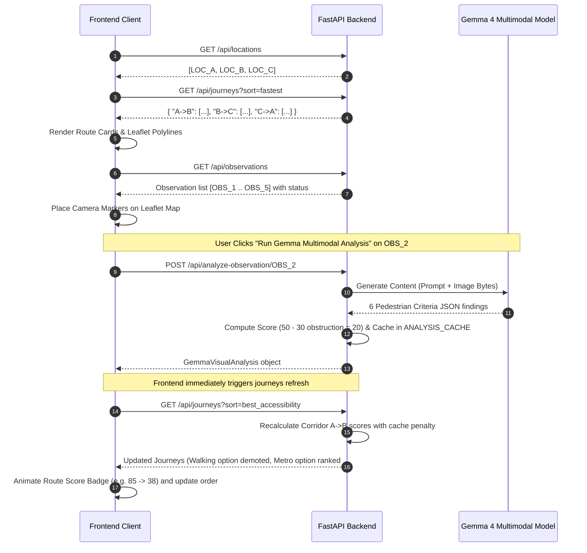
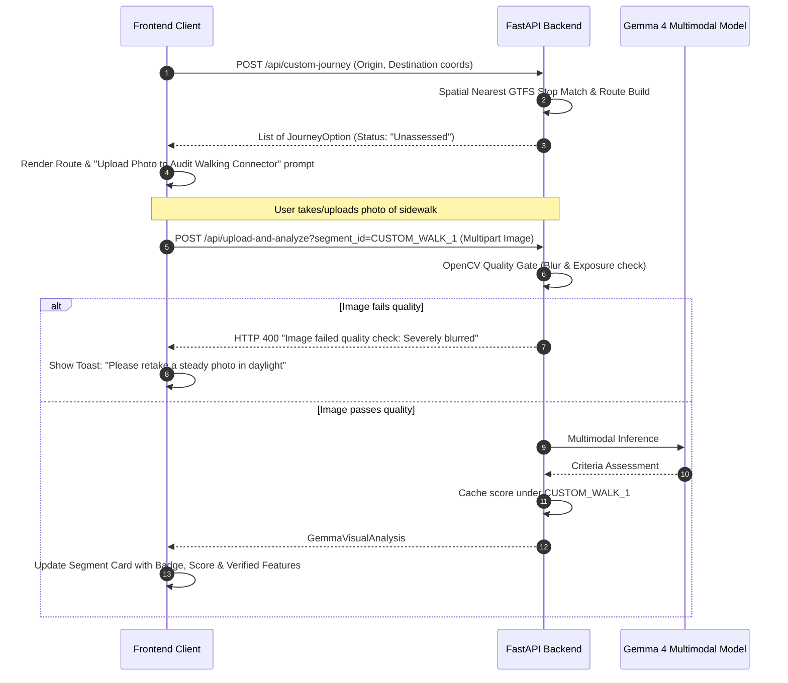

# Saakshi API & Frontend-Backend Integration Contract
**Version:** 2.0.0  
**Project:** Saakshi — Bengaluru Multimodal Pedestrian Accessibility & Transit Planner  
**Target Audience:** Frontend Engineers / UI Developers / Mobile Developers  
**Base Server URL:** `http://localhost:8000` (Development)  

---

## 1. System Overview & Architecture

Saakshi is an evidence-based pedestrian accessibility and multimodal transit planner designed specifically for Bengaluru. Unlike conventional map apps that treat walking as a simple distance/time calculation, Saakshi uses **Google Gemma Multimodal Vision** and **OpenCV image analysis** to audit ground-level walkability barriers (curbs without ramps, broken footpaths, vendor/vehicle encroachment, missing tactile paving) and dynamically re-ranks public transit corridors based on real physical accessibility.

### Two Operational Modes
1. **Mode A: Curated Corridor Demo (Fixed Locations)**
   - Corridors connecting three canonical transit hubs:
     - **Location A:** MG Road Metro Station (`LOC_A`)
     - **Location B:** Cubbon Park Metro Station (`LOC_B`)
     - **Location C:** Kempegowda Interchange / Majestic (`LOC_C`)
   - Pre-compiled GTFS routes (BMRCL Purple Line, BMTC Bus lines, walking connectors).
   - Ground-truth Street View observation points (`OBS_1` through `OBS_5`) ready for real-time Gemma vision analysis.
   - Dynamic route re-ranking when vision findings detect obstacles.

2. **Mode B: Custom Point-to-Point Routing (Arbitrary Locations)**
   - Any origin and destination in Bengaluru (e.g. Koramangala to Indiranagar).
   - Resolves genuine nearby BMTC stops from GTFS index (`data/gtfs/bmtc.zip`).
   - Supports user-submitted pedestrian photos (`POST /api/upload-and-analyze`) to audit custom walking connector segments.

3. **Standalone Single-Image Analysis (`POST /api/analyze`)**
   - Independent photo inspection tool running OpenCV quality verification and deterministic barrier gate classification (`BARRIER`, `NO_BARRIER_OBSERVED`, `INCONCLUSIVE`).

---

## 2. Global Request & Response Conventions

### Base URL & Transport
```http
Base URL (Dev):  http://localhost:8000
Protocols:       HTTP/1.1, HTTP/2
CORS:            Enabled for all origins (*) in development
```

### Standard Headers
| Header | Usage |
|---|---|
| `Accept: application/json` | Required for all JSON API endpoints |
| `Content-Type: application/json` | Required for JSON request bodies |
| `Content-Type: multipart/form-data` | Required for image upload endpoints |

### Standard Error Envelope
FastAPI produces standardized error responses with HTTP `4xx` or `5xx`:

```json
{
  "detail": "Descriptive error message string or validation errors array"
}
```

Validation error structure (HTTP 422):
```json
{
  "detail": [
    {
      "loc": ["body", "origin_lat"],
      "msg": "field required",
      "type": "value_error.missing"
    }
  ]
}
```

---

## 3. Endpoints Specification

### 3.1 `GET /health`
Inspects backend system operational status and model runtime configuration.

* **Method:** `GET`
* **Path:** `/health`
* **Query Parameters:** None
* **Request Body:** None

#### Response (HTTP 200 OK)
```json
{
  "status": "ok",
  "app": "saakshi",
  "version": "2.0.0",
  "configured_model": "gemma-4-26b-a4b-it"
}
```

---

### 3.2 `GET /api/locations`
Retrieves canonical fixed demo locations for Mode A (MG Road, Cubbon Park, Majestic) including verified coordinates and accessible entrance IDs.

* **Method:** `GET`
* **Path:** `/api/locations`
* **Query Parameters:** None

#### Response (HTTP 200 OK)
```json
[
  {
    "id": "LOC_A",
    "key": "A",
    "name": "MG Road Metro Station",
    "short_name": "MG Road (A)",
    "canonical_name": "MG Road Metro Station, Mahatma Gandhi Road, Ashok Nagar, Bengaluru",
    "lat": 12.975526,
    "lon": 77.606790,
    "place_ref": "BMRCL:MAGR",
    "osm_ref": "node/MG_Road_Metro",
    "description": "MG Road / Church Street commercial pedestrian precinct; BMRCL Purple Line Station.",
    "accessible_entrances": ["MAGR_A", "MAGR_B", "MAGR_C", "MAGR_D"]
  },
  {
    "id": "LOC_B",
    "key": "B",
    "name": "Cubbon Park Metro Station",
    "short_name": "Cubbon Park (B)",
    "canonical_name": "Cubbon Park Metro Station, Kasturba Road, Bengaluru",
    "lat": 12.980958,
    "lon": 77.597570,
    "place_ref": "BMRCL:CBPK",
    "osm_ref": "node/Cubbon_Park_Metro",
    "description": "Kasturba Road / Cubbon Park recreational and government precinct; BMRCL Purple Line Station.",
    "accessible_entrances": ["CBPK_A", "CBPK_B", "CBPK_D"]
  },
  {
    "id": "LOC_C",
    "key": "C",
    "name": "Nadaprabhu Kempegowda Station, Majestic",
    "short_name": "Majestic (C)",
    "canonical_name": "Nadaprabhu Kempegowda Station Majestic / Kempegowda Bus Station (KBS), Bengaluru",
    "lat": 12.975708,
    "lon": 77.572876,
    "place_ref": "BMRCL:KGWA",
    "osm_ref": "node/Majestic_Interchange",
    "description": "Central transit interchange connecting BMRCL Purple/Green lines and BMTC bus terminals.",
    "accessible_entrances": ["KGWA_A", "KGWA_B", "KGWA_C", "KGWA_D", "KGWA_E"]
  }
]
```

---

### 3.3 `GET /api/journeys`
Retrieves pre-compiled multimodal route alternatives for all Mode A directions (`A->B`, `B->C`, `C->A`). Incorporates dynamic Gemma accessibility re-scoring and sorting.

* **Method:** `GET`
* **Path:** `/api/journeys`
* **Query Parameters:**
  * `sort` *(string, optional, default: `"fastest"`)*:
    * `"fastest"` — Shortest travel duration
    * `"least_walking"` — Minimum walking distance in meters
    * `"fewest_transfers"` — Minimum transit line transfers
    * `"best_accessibility"` — Highest composite accessibility score (0–100)

#### Response (HTTP 200 OK)
Returns a dictionary keyed by direction string (`"A->B"`, `"B->C"`, `"C->A"`), where each value is an array of `JourneyOption` objects.

```json
{
  "A->B": [
    {
      "id": "J_AB_METRO",
      "journey_key": "A->B",
      "origin_key": "A",
      "destination_key": "B",
      "origin_name": "MG Road Metro Station",
      "destination_name": "Cubbon Park Metro Station",
      "primary_mode": "metro",
      "title": "BMRCL Purple Line Metro (Direct)",
      "summary": "Elevator-accessible metro connection between MG Road and Cubbon Park. 1 stop.",
      "total_duration_minutes": 9,
      "total_walking_distance_meters": 210,
      "total_transfers": 0,
      "estimated_wait_time_minutes": 3,
      "total_fare_inr": 10.0,
      "accessibility_score": 94.0,
      "accessibility_verdict": "Highly Accessible",
      "accessibility_concerns": [],
      "recommendation_reasons": [
        "Fastest transit option (9 min total door-to-door).",
        "Elevator access verified at both MG Road and Cubbon Park stations."
      ],
      "data_provenance": {
        "metro_schedule": "verified_bmrcl_gtfs",
        "walking_segments": "estimated_walking_speed",
        "accessibility": "google_street_view_and_survey"
      },
      "limitations": [
        "Platform gaps exist between train and platform (~7cm horizontal, 3cm vertical)."
      ],
      "segments": [
        {
          "id": "AB_M_1",
          "mode": "walking",
          "from_name": "MG Road Station Entrance A",
          "to_name": "MG Road Platform 1",
          "from_lat": 12.975526,
          "from_lon": 77.606790,
          "to_lat": 12.975429,
          "to_lon": 77.607260,
          "distance_meters": 110,
          "duration_minutes": 2,
          "transit_line": null,
          "agency": "Pedestrian",
          "num_intermediate_stops": 0,
          "intermediate_stops": [],
          "fare_inr": null,
          "headway_minutes": null,
          "data_source": "estimated_walking_speed",
          "wheelchair_accessible": true,
          "pedestrian_concerns": [],
          "polyline": [
            [12.975526, 77.606790],
            [12.975429, 77.607260]
          ]
        },
        {
          "id": "AB_M_2",
          "mode": "metro",
          "from_name": "MG Road Metro Station",
          "to_name": "Cubbon Park Metro Station",
          "from_lat": 12.975429,
          "from_lon": 77.607260,
          "to_lat": 12.980958,
          "to_lon": 77.597570,
          "distance_meters": 1300,
          "duration_minutes": 4,
          "transit_line": "Purple Line",
          "agency": "BMRCL",
          "num_intermediate_stops": 0,
          "intermediate_stops": [],
          "fare_inr": 10.0,
          "headway_minutes": 5,
          "data_source": "verified_bmrcl_gtfs",
          "wheelchair_accessible": true,
          "pedestrian_concerns": [],
          "polyline": [
            [12.975429, 77.607260],
            [12.980958, 77.597570]
          ]
        }
      ],
      "observations": []
    }
  ],
  "B->C": [],
  "C->A": []
}
```

---

### 3.4 `GET /api/observations`
Lists all prepared Street View observation points along the demo corridors, indicating whether imagery is present and whether Gemma analysis has been completed.

* **Method:** `GET`
* **Path:** `/api/observations`

#### Response (HTTP 200 OK)
```json
[
  {
    "id": "OBS_1",
    "name": "MG Road Metro Entrance A / Church Street",
    "location": "MG Road (Point A)",
    "lat": 12.975420,
    "lon": 77.606510,
    "image_filename": "data/street_view/a_to_b/0001.png",
    "image_url": "/api/images/data/street_view/a_to_b/0001.png",
    "image_available": true,
    "status": "ready_for_analysis",
    "analysis": null
  },
  {
    "id": "OBS_2",
    "name": "Kasturba Road / Cubbon Park Walkway",
    "location": "Kasturba Road connector (A <-> B)",
    "lat": 12.978900,
    "lon": 77.600900,
    "image_filename": "data/street_view/a_to_b/0011.png",
    "image_url": "/api/images/data/street_view/a_to_b/0011.png",
    "image_available": true,
    "status": "ready_for_analysis",
    "analysis": null
  }
]
```
*Possible `status` values:*
* `"ready_for_analysis"` — Image file exists on disk, waiting for inference.
* `"analysis_completed"` — Gemma has run; `analysis` contains the full analysis payload.
* `"image_uncollected"` — Image file is missing from disk.

---

### 3.5 `POST /api/analyze-observation/{obs_id}`
Triggers multimodal Gemma inference on a prepared observation image (`OBS_1` to `OBS_5`). Updates the server's analysis cache and causes future calls to `GET /api/journeys` to recalculate accessibility scores and re-sort routes.

* **Method:** `POST`
* **Path:** `/api/analyze-observation/{obs_id}`
* **Path Parameters:**
  * `obs_id` *(string, required)*: Identifier, e.g. `OBS_1`, `OBS_2`, `OBS_3`, `OBS_4`, `OBS_5`.
* **Request Body:** None

#### Response (HTTP 200 OK)
```json
{
  "image_id": "OBS_1",
  "location_id": "MG Road (Point A)",
  "segment_id": null,
  "status": "completed",
  "inference_source": "live_gemma_api",
  "model_used": "gemma-4-26b-a4b-it",
  "evidence_status": "NO_BARRIER_OBSERVED",
  "sidewalk": {
    "criterion": "sidewalk",
    "label": "Sidewalk Continuity",
    "status": "present",
    "confidence": "high",
    "explanation": "Cobblestone pedestrianized Church Street plaza provides wide, continuous walkway."
  },
  "curb_ramps": {
    "criterion": "curb_ramps",
    "label": "Curb Ramps",
    "status": "present",
    "confidence": "medium",
    "explanation": "Flush transition between plaza and road entrance."
  },
  "tactile_paving": {
    "criterion": "tactile_paving",
    "label": "Tactile Paving",
    "status": "absent",
    "confidence": "high",
    "explanation": "No warning blister or directional tactile guide tiles observed on pavers."
  },
  "pedestrian_crossings": {
    "criterion": "pedestrian_crossings",
    "label": "Pedestrian Crossings",
    "status": "present",
    "confidence": "high",
    "explanation": "Grade-separated entrance with signalized crossing at Anil Kumble circle."
  },
  "obstructions": {
    "criterion": "obstructions",
    "label": "Obstructions & Encroachment",
    "status": "absent",
    "confidence": "high",
    "explanation": "Wide pedestrian plaza clear of construction debris or parked vehicles."
  },
  "surface_damage": {
    "criterion": "surface_damage",
    "label": "Surface Damage",
    "status": "absent",
    "confidence": "medium",
    "explanation": "Cobblestone and granite pavers are intact without potholes or displacement."
  },
  "calculated_accessibility_score": 88.0,
  "summary": "Pedestrian plaza offers barrier-free access with level transition, though tactile guiding tiles are absent.",
  "limitations": [
    "Assessment based on single daytime image angle.",
    "Does not evaluate nighttime lighting or weather conditions."
  ]
}
```

#### Error Responses
* **HTTP 400 Bad Request:** `{"detail": "Observation 'OBS_99' not found in registry."}`
* **HTTP 500 Internal Server Error:** `{"detail": "Error during multimodal inference: ..."}`

---

### 3.6 `POST /api/custom-journey`
Plans multimodal transit and walking options for arbitrary coordinates (Mode B). Automatically queries BMTC GTFS stops to match real nearest bus stops and walking paths.

* **Method:** `POST`
* **Path:** `/api/custom-journey`
* **Headers:** `Content-Type: application/json`

#### Request Body
```json
{
  "origin_name": "Koramangala BDA Complex",
  "origin_lat": 12.934500,
  "origin_lon": 77.622500,
  "dest_name": "Indiranagar 100ft Road",
  "dest_lat": 12.971900,
  "dest_lon": 77.641200,
  "sort": "fastest"
}
```
*Note:* `sort` can be `"fastest"`, `"least_walking"`, `"fewest_transfers"`, or `"best_accessibility"`. Default is `"fastest"`.

#### Response (HTTP 200 OK)
Returns a list of `JourneyOption` objects (same structure as in `/api/journeys`).

```json
[
  {
    "id": "CUSTOM_BUS_1",
    "journey_key": "CUSTOM",
    "origin_key": "ORIGIN",
    "destination_key": "DEST",
    "origin_name": "Koramangala BDA Complex",
    "destination_name": "Indiranagar 100ft Road",
    "primary_mode": "bus",
    "title": "BMTC Direct Bus Route",
    "summary": "Bus connection via matched stops with pedestrian access connectors.",
    "total_duration_minutes": 32,
    "total_walking_distance_meters": 450,
    "total_transfers": 0,
    "estimated_wait_time_minutes": 8,
    "total_fare_inr": 25.0,
    "accessibility_score": 50.0,
    "accessibility_verdict": "Unassessed",
    "accessibility_concerns": ["Visual evidence not available or unassessed for this segment."],
    "recommendation_reasons": ["Direct public transit without transfers."],
    "data_provenance": {
      "bus_stops": "gtfs_stop_matched_spatial_estimate"
    },
    "limitations": [
      "Walking connector walkability has not been verified with imagery. Upload a photo to audit."
    ],
    "segments": [
      {
        "id": "CUSTOM_WALK_1",
        "mode": "walking",
        "from_name": "Koramangala BDA Complex",
        "to_name": "Koramangala TTMC",
        "from_lat": 12.934500,
        "from_lon": 77.622500,
        "to_lat": 12.935100,
        "to_lon": 77.623100,
        "distance_meters": 180,
        "duration_minutes": 3,
        "agency": "Pedestrian",
        "wheelchair_accessible": true,
        "polyline": [
          [12.934500, 77.622500],
          [12.935100, 77.623100]
        ]
      }
    ],
    "observations": []
  }
]
```

---

### 3.7 `POST /api/upload-and-analyze`
Uploads a user-captured pedestrian photo for a specific route walking segment (Mode B). Passes through OpenCV blur/exposure checks and evaluates the 6 accessibility criteria via Gemma.

* **Method:** `POST`
* **Path:** `/api/upload-and-analyze`
* **Query Parameters:**
  * `segment_id` *(string, required)*: Identifier of the route segment (e.g. `"CUSTOM_WALK_1"`).
* **Headers:** `Content-Type: multipart/form-data`
* **Form Data:**
  * `image` *(File, required)*: Binary image (JPEG, PNG, WebP; max 10MB).

#### Response (HTTP 200 OK)
Returns a `GemmaVisualAnalysis` object (same structure as endpoint 3.5). The result is cached under `segment_id` in the backend, recalculating journey accessibility.

#### Error Responses
* **HTTP 400 Bad Request:**
  * `{"detail": "Image failed quality check: Image is severely blurred (Laplacian variance 42.1 < 100.0)"}`
  * `{"detail": "Unsupported format 'image/gif'. Supported: image/jpeg, image/jpg, image/png, image/webp"}`
  * `{"detail": "Image size exceeds maximum limit of 10 MB."}`

---

### 3.8 `POST /api/analyze`
Standalone single-image inspection endpoint (Task 1 contract). Runs OpenCV image quality heuristics, queries the Gemma model for barriers, and executes the deterministic evidence gate.

* **Method:** `POST`
* **Path:** `/api/analyze`
* **Headers:** `Content-Type: multipart/form-data`
* **Form Data:**
  * `image` *(File, required)*: Binary image (JPEG, PNG, WebP; max 10MB).

#### Response (HTTP 200 OK)
```json
{
  "status": "BARRIER",
  "observations": {
    "visible_barriers": [
      {
        "type": "curb",
        "description": "High unramped sidewalk curb ~20cm obstructing crosswalk",
        "location": "left sidewalk",
        "visibility": "clear"
      },
      {
        "type": "broken_pavement",
        "description": "Missing pavers exposing open mud and uneven stones",
        "location": "path center",
        "visibility": "clear"
      }
    ],
    "visible_features": [
      "wide_sidewalk"
    ],
    "uncertain_observations": [],
    "limitations": [
      "Single camera angle only."
    ]
  },
  "image_quality": {
    "passed": true,
    "laplacian_variance": 245.8,
    "mean_brightness": 128.4,
    "issues": []
  },
  "limitations": [
    "Assessment based on single static street view image.",
    "Cannot guarantee continuous accessibility beyond visible frame."
  ],
  "reason": "Clear visible physical barriers (curb, broken pavement) detected in pedestrian path."
}
```

*Possible `status` values:*
* `"BARRIER"` — Verified physical obstacle obstructing pedestrian or wheelchair path.
* `"NO_BARRIER_OBSERVED"` — Image meets quality standards and no obstacles were visible.
* `"INCONCLUSIVE"` — Image failed quality check (blur/exposure) or model returned visual ambiguity.

---

### 3.9 `GET /api/images/{file_path:path}`
Static image streaming endpoint for street view and observation images.

* **Method:** `GET`
* **Path:** `/api/images/{file_path}` (e.g. `/api/images/data/street_view/a_to_b/0001.png` or `/api/images/OBS_1_mg_road.jpg`)
* **Response:** Raw binary image with appropriate `Content-Type: image/jpeg` or `image/png`.
* **Errors:** HTTP 404 if file does not exist on disk.

---

## 4. Complete TypeScript Type Definitions (`types.ts`)

Share this exact block directly with your frontend developer. It matches the Pydantic schemas 1-to-1:

```typescript
/**
 * Saakshi Pedestrian Accessibility & Transit Planner
 * API Type Definitions
 */

// --- ENUMS & PRIMITIVES ---

export type AssessmentStatus = 'BARRIER' | 'NO_BARRIER_OBSERVED' | 'INCONCLUSIVE';
export type BarrierVisibility = 'clear' | 'partial' | 'uncertain';
export type FeatureStatus = 'present' | 'absent' | 'unknown';
export type ConfidenceRating = 'high' | 'medium' | 'low';
export type TransitMode = 'metro' | 'bus' | 'walking' | 'mixed';
export type SortCriterion = 'fastest' | 'least_walking' | 'fewest_transfers' | 'best_accessibility';
export type InferenceSource = 'live_local_gemma' | 'live_gemma_api' | 'offline_demo' | 'unavailable';
export type ObservationStatus = 'ready_for_analysis' | 'analysis_completed' | 'image_uncollected';

// --- SYSTEM HEALTH ---

export interface HealthResponse {
  status: string;
  app: string;
  version: string;
  configured_model: string;
}

// --- LOCATIONS ---

export interface DemoLocation {
  id: string; // e.g. "LOC_A"
  key: string; // "A" | "B" | "C"
  name: string;
  short_name: string;
  canonical_name: string;
  lat: number;
  lon: number;
  place_ref: string;
  osm_ref: string;
  description: string;
  accessible_entrances: string[];
}

// --- ROUTE & TRANSIT MODELS ---

export interface RouteSegment {
  id: string;
  mode: TransitMode;
  from_name: string;
  to_name: string;
  from_lat: number;
  from_lon: number;
  to_lat: number;
  to_lon: number;
  distance_meters: number;
  duration_minutes: number;
  transit_line: string | null;
  agency: string | null;
  num_intermediate_stops: number;
  intermediate_stops: string[];
  fare_inr: number | null;
  headway_minutes: number | null;
  data_source: string;
  wheelchair_accessible: boolean;
  pedestrian_concerns: string[];
  polyline: [number, number][]; // [lat, lon] tuples
}

export interface JourneyOption {
  id: string;
  journey_key: string; // "A->B" | "B->C" | "C->A" | "CUSTOM"
  origin_key: string;
  destination_key: string;
  origin_name: string;
  destination_name: string;
  primary_mode: TransitMode;
  title: string;
  summary: string;
  total_duration_minutes: number;
  total_walking_distance_meters: number;
  total_transfers: number;
  estimated_wait_time_minutes: number;
  total_fare_inr: number;
  segments: RouteSegment[];
  observations: PedestrianObservation[];
  accessibility_score: number; // 0.0 - 100.0
  accessibility_verdict: string; // "Highly Accessible" | "Moderate Accessibility" | "Significant Physical Barriers" | "Unassessed"
  accessibility_concerns: string[];
  data_provenance: Record<string, string>;
  recommendation_reasons: string[];
  limitations: string[];
}

// --- ACCESSIBILITY & OBSERVATIONS ---

export interface AccessibilityCriterionFinding {
  criterion: 'sidewalk' | 'curb_ramps' | 'tactile_paving' | 'pedestrian_crossings' | 'obstructions' | 'surface_damage';
  label: string;
  status: FeatureStatus; // "present" | "absent" | "unknown"
  confidence: ConfidenceRating; // "high" | "medium" | "low"
  explanation: string;
}

export interface GemmaVisualAnalysis {
  image_id: string;
  location_id?: string | null;
  segment_id?: string | null;
  status: string; // "completed" | "image_unavailable" | "runtime_unavailable" | "unassessed"
  inference_source: InferenceSource;
  model_used: string;
  evidence_status?: AssessmentStatus | null;
  sidewalk: AccessibilityCriterionFinding;
  curb_ramps: AccessibilityCriterionFinding;
  tactile_paving: AccessibilityCriterionFinding;
  pedestrian_crossings: AccessibilityCriterionFinding;
  obstructions: AccessibilityCriterionFinding;
  surface_damage: AccessibilityCriterionFinding;
  calculated_accessibility_score: number;
  summary: string;
  limitations: string[];
}

export interface ObservationPoint {
  id: string; // "OBS_1"
  name: string;
  location: string;
  lat: number;
  lon: number;
  image_filename: string;
  image_url: string;
  image_available: boolean;
  status: ObservationStatus;
  analysis: GemmaVisualAnalysis | null;
}

export interface PedestrianObservation {
  id: string;
  name: string;
  location_desc: string;
  lat: number;
  lon: number;
  journey_associations: string[];
  streetview_available: boolean;
  inspection_status: string;
  capture_date?: string | null;
  imagery_reference: string;
  imagery_source: string;
  sidewalk: AccessibilityCriterionFinding;
  curb_ramps: AccessibilityCriterionFinding;
  tactile_paving: AccessibilityCriterionFinding;
  pedestrian_crossings: AccessibilityCriterionFinding;
  obstructions: AccessibilityCriterionFinding;
  surface_damage: AccessibilityCriterionFinding;
  accessibility_score: number;
  summary_verdict: string;
  limitations: string[];
}

// --- SINGLE-IMAGE ANALYSIS (Task 1) ---

export interface VisibleBarrier {
  type: string;
  description: string;
  location: string;
  visibility: BarrierVisibility;
}

export interface ModelObservations {
  visible_barriers: VisibleBarrier[];
  visible_features: string[];
  uncertain_observations: string[];
  limitations: string[];
}

export interface ImageQualityResult {
  passed: bool;
  laplacian_variance: number;
  mean_brightness: number;
  issues: string[];
}

export interface AnalysisResponse {
  status: AssessmentStatus;
  observations: ModelObservations;
  image_quality: ImageQualityResult;
  limitations: string[];
  reason: string;
}

// --- REQUEST BODIES ---

export interface CustomJourneyRequest {
  origin_name: string;
  origin_lat: number;
  origin_lon: number;
  dest_name: string;
  dest_lat: number;
  dest_lon: number;
  sort?: SortCriterion;
}
```

---

## 5. Frontend Interaction Lifecycles

### Workflow 1: Mode A Corridor Exploration & Dynamic Re-Ranking


### Workflow 2: Mode B Custom Point-to-Point Journey & User Photo Audit


---

## 6. Frontend UI / UX Guidelines & Style Tokens

To preserve visual consistency across web and mobile implementations:

### Design Tokens
| Token | Hex Value | Usage |
|---|---|---|
| `--color-metro` | `#a855f7` | BMRCL Purple line badges, metro polylines |
| `--color-bus` | `#38bdf8` | BMTC Bus routes, bus stop markers |
| `--color-walk` | `#f59e0b` | Pedestrian connectors, walking polyline dash |
| `--color-accessible` | `#10b981` | Score ≥ 80, "Highly Accessible", green badge |
| `--color-moderate` | `#f59e0b` | Score 50–79, "Moderate Accessibility", amber |
| `--color-barrier` | `#f43f5e` | Score < 50, "Significant Physical Barriers", red |
| `--bg-dark` | `#090d16` | Main background |
| `--bg-card` | `rgba(16, 24, 40, 0.85)` | Glassmorphism card background |

### Scoring & Verdict Mapping
The backend calculates scores strictly between `5.0` and `98.0`:
* **Score ≥ 80.0:** `Highly Accessible` → Green badge (`#10b981`), recommended for all mobilities.
* **Score 50.0 – 79.9:** `Moderate Accessibility` → Amber badge (`#f59e0b`), passable with caution.
* **Score < 50.0:** `Significant Physical Barriers` → Red badge (`#f43f5e`), warnings displayed prominently.
* **Unassessed:** Base score `50.0` with notice: *"Visual evidence not yet audited."*

### Rendering the 6 Gemma Criteria
When displaying `GemmaVisualAnalysis`, present the 6 criteria in a 2x3 or vertical checklist:
1. **Sidewalk Continuity** (`sidewalk`)
2. **Curb Ramps** (`curb_ramps`)
3. **Tactile Paving** (`tactile_paving`)
4. **Pedestrian Crossings** (`pedestrian_crossings`)
5. **Obstructions & Encroachment** (`obstructions`)
6. **Surface Damage** (`surface_damage`)

Status Badges:
* `present` → Green check / badge (for positive features like ramps, sidewalk)
* `absent` → Red cross / warning (or green if obstructions/damage are absent)
* `unknown` → Neutral gray pill: *"Unclear in photo"*

---

## 7. Error Handling & Edge-Case Checklist

| Scenario | HTTP Status | Backend Response Detail | Recommended Frontend Handling |
|---|---|---|---|
| Image is blurry (Laplacian var < 100) | `400` | `"Image failed quality check: Image is severely blurred..."` | Display friendly dialog asking the user to hold camera steady and retake. |
| Image is too dark (mean < 35) | `400` | `"Image failed quality check: Image is severely underexposed..."` | Advise user to take photo with flash or in daytime lighting. |
| Unsupported file extension | `400` | `"Unsupported format 'image/gif'. Supported: jpeg, png, webp"` | Enforce `accept="image/jpeg,image/png,image/webp"` on the HTML file input. |
| File exceeds 10MB | `400` | `"Image size exceeds maximum limit of 10 MB."` | Client-side size validation before sending network request. |
| Model runtime unavailable / API limit | `200` | `status: "runtime_unavailable"`, `inference_source: "unavailable"` | Gracefully display fallback message: *"Live vision analysis temporarily unavailable. Showing baseline catalog data."* |
| Route has no transit connection | `200` | Returns walking-only `JourneyOption` | Warn user that distance is high and public transit is not currently matched. |

---

## 8. Quick cURL Integration Cheatsheet

### 1. Check Backend Health
```bash
curl -X GET http://localhost:8000/health
```

### 2. Fetch Journeys Sorted by Accessibility
```bash
curl -X GET "http://localhost:8000/api/journeys?sort=best_accessibility"
```

### 3. Run Gemma on Observation 1
```bash
curl -X POST http://localhost:8000/api/analyze-observation/OBS_1
```

### 4. Plan Custom Route (Mode B)
```bash
curl -X POST http://localhost:8000/api/custom-journey \
  -H "Content-Type: application/json" \
  -d '{
    "origin_name": "Koramangala BDA Complex",
    "origin_lat": 12.9345,
    "origin_lon": 77.6225,
    "dest_name": "Indiranagar 100ft Road",
    "dest_lat": 12.9719,
    "dest_lon": 77.6412,
    "sort": "fastest"
  }'
```

### 5. Upload Custom Pedestrian Photo
```bash
curl -X POST "http://localhost:8000/api/upload-and-analyze?segment_id=CUSTOM_WALK_1" \
  -F "image=@/path/to/sidewalk_photo.jpg"
```
